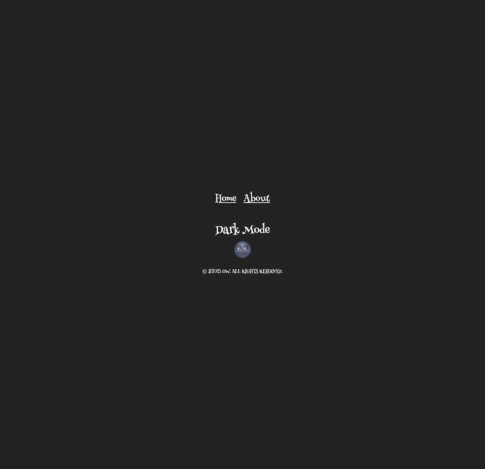

# React-Redux-Dark-Mode

## 🔗 Demo

https://githubgw.github.io/react-redux-dark-mode

## 🖥 Preview

## 🔥 Stack

### Front-end

 

## ✅ Packages

- [x] React
- [x] Redux
- [x] Styled Components

## ⚙ React Redux

- [x] mapStateToProps
- [x] mapDispatchToProps
